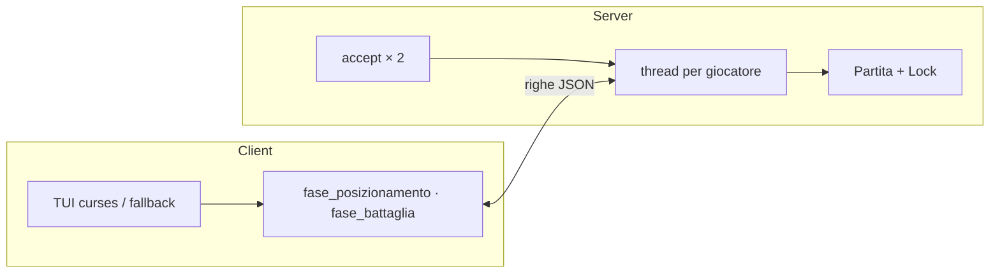
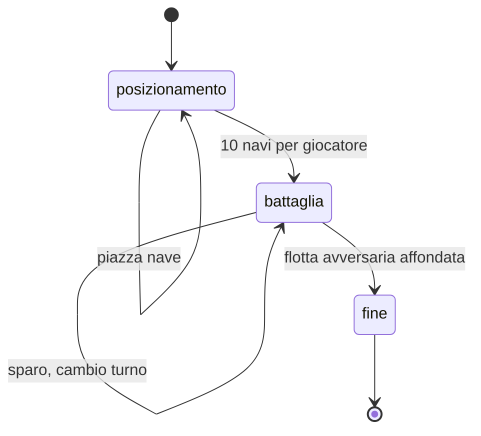
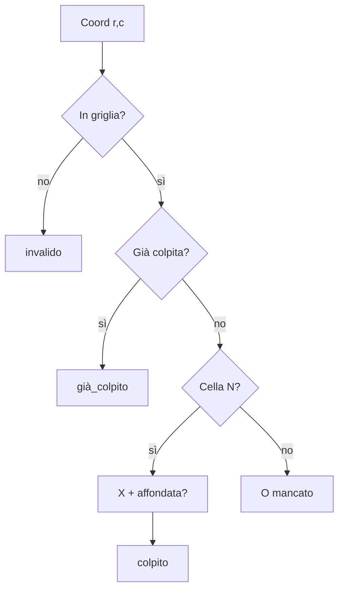
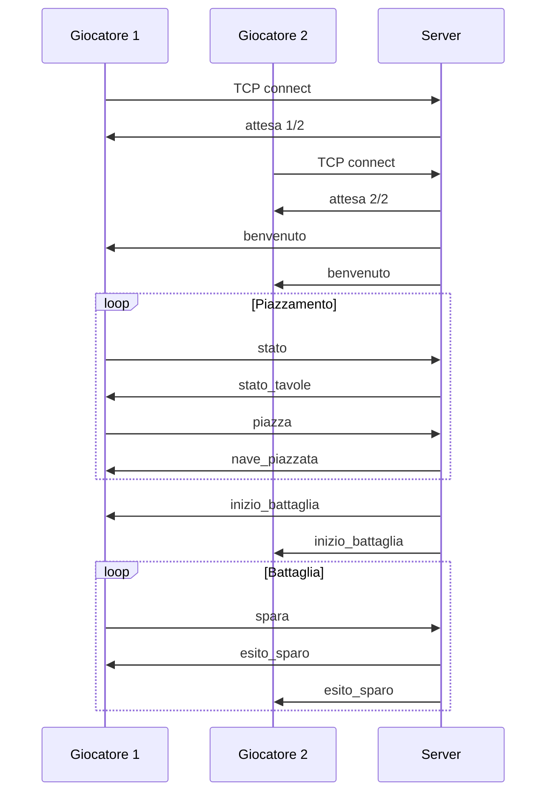
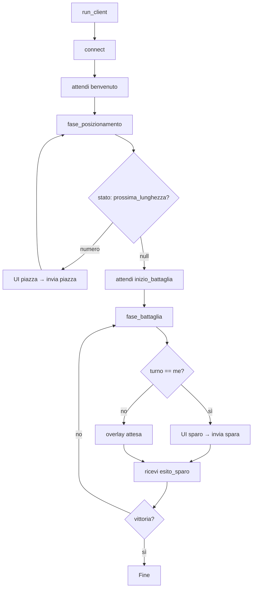

# Battaglia Navale — Datasheet tecnico

Documentazione di architettura, protocollo e comportamento del codice in `battaglia_navale.py`. Per avvio rapido e regole utente vedi `README.md`.

---

## Indice

- [Cos’è e come gira](#cosè-e-come-gira)
- [Requisiti](#requisiti)
- [Architettura](#architettura)
- [Regole di gioco (implementazione)](#regole-di-gioco-implementazione)
- [Stato della partita](#stato-della-partita)
- [Protocollo TCP/JSON](#protocollo-tcpjson)
- [Server: connessioni e thread](#server-connessioni-e-thread)
- [Client: flusso di gioco](#client-flusso-di-gioco)
- [Interfaccia terminale](#interfaccia-terminale)
- [Rete, config e file locali](#rete-config-e-file-locali)
- [Comandi e procedure](#comandi-e-procedure)
- [Errori del protocollo](#errori-del-protocollo)
- [Limiti e sicurezza](#limiti-e-sicurezza)
- [Guida al sorgente](#guida-al-sorgente)
- [Glossario](#glossario)

---

## Cos’è e come gira

Applicazione **a due giocatori** in terminale: un **server** tiene la partita in memoria, due **client** inviano comandi e disegnano le griglie. Tutto è in **un solo file Python** (stdlib, nessun `pip install`).

Tre modi di esecuzione:

| Modalità | Come si avvia | Ruolo |
|----------|---------------|--------|
| Launcher | `python3 battaglia_navale.py` o `./avvia.sh` | Menu: server in background, client, stato, stop |
| Server | `python3 battaglia_navale.py server [host] [porta]` | Accetta 2 TCP, gestisce la partita |
| Client | `python3 battaglia_navale.py client [host] [porta]` | Gioca una sessione fino a vittoria o disconnect |

```text
  ┌─────────────┐     Popen      ┌──────────────┐
  │  Launcher   │───────────────►│ Server       │
  │ (menu)      │                │ run_server   │
  └──────┬──────┘                └──────▲───────┘
         │ subprocess client            │
         │ (×2 terminali)                 │ TCP
         ▼                                │
  ┌─────────────┐              ┌─────────┴─────────┐
  │ Client G1   │──────────────│ JSON + newline    │
  └─────────────┘              │ per messaggio     │
  ┌─────────────┐              └─────────▲─────────┘
  │ Client G2   │────────────────────────┘
  └─────────────┘
```

Il launcher **non partecipa** alla partita: avvia processi e mostra indirizzi. Lo **stato di gioco valido** esiste solo nel processo server.

---

## Requisiti

| Area | Dettaglio |
|------|-----------|
| Python | 3.10 o superiore |
| OS | Linux, macOS, Windows (TUI adattiva) |
| Terminale | Unicode consigliato; larghezza utile ≥ 80 colonne per layout comodo |
| Rete | Porta TCP 1024–65535 (default **5555**); due client raggiungibili dal server |
| Optional | `curses` dove disponibile; altrimenti input raw / `msvcrt` su Windows |

File creati a runtime (cartella `.battaglia_navale/`):

| File | Uso |
|------|-----|
| `server.pid` | PID del server avviato dal menu |
| `server.log` | Output del server in background |
| `server.json` | Ultimo `host`, `porta`, preferenze UI |

---

## Architettura

### Separazione delle responsabilità



| Pezzo | Cosa fa |
|-------|---------|
| `Tavola` | Griglia 10×10, flotta, logica colpo/affondamento |
| `Partita` | Due tavole, fase, turno, vincitore; mutazioni sotto lock |
| `Ricevitore` | Legge byte TCP fino a `\n`, deserializza JSON |
| `invia` | Serializza JSON + `\n` e `sendall` |
| `run_server` | Socket, 2 accept, dispatch messaggi |
| `run_client` | Connect, benvenuto, loop fasi |
| `loop_launcher` | Menu, `Popen` server, `subprocess` client, PID |

### Strati nel monolite (dipendenze verso il basso)

```text
  Presentazione     menu, riquadri ANSI, griglie curses
        │
  Sessione client   richiedi_stato, seleziona_piazza/sparo, overlay
        │
  Rete              invia, Ricevitore, gestisci_client
        │
  Dominio           Partita, Tavola, parse_coordinata
        │
  Infra             config JSON, PID, probe porte, IP LAN/pubblico
```

---

## Regole di gioco (implementazione)

Parametri fissi nel codice:

```python
DIMENSIONE_GRIGLIA = 10
COLONNE = "ABCDEFGHIJ"          # A = colonna 0
LUNGHEZZE_NAVI = [4, 3, 3, 2, 2, 2, 1, 1, 1, 1]  # 10 navi, 17 caselle
```

### Piazzamento

- Ogni giocatore piazza **nell’ordine** delle lunghezze in `LUNGHEZZE_NAVI`.
- Una nave: cella origine `(riga, colonna)` + flag `orizzontale` (destra) o verticale (giù).
- Non ammessi: fuori griglia, sovrapposizioni.
- I due giocatori piazzano **in contemporanea** (nessun turno in questa fase).

### Battaglia

- Ingresso battaglia quando **entrambi** hanno piazzato 10 navi.
- Primo turno: **giocatore 1**.
- Solo chi ha il turno può mandare `spara`.
- Una cella può essere colpita **una sola volta**.
- Colpo su nave → cella `X`; su acqua → `O`.
- Nave affondata quando **tutti** i suoi segmenti sono `X`.
- Dopo uno sparo valido (senza vittoria) il turno passa **sempre** all’avversario.
- Vince chi affonda **tutta** la flotta avversaria (17 celle nave colpite).

### Coordinate

Notazione utente: lettera + numero, es. `B7` → riga indice `6`, colonna indice `1` (`parse_coordinata`).

```text
        A   B   C   D   E   F   G   H   I   J
      +---+---+---+---+---+---+---+---+---+---+
    1 |   |   |   |   |   |   |   |   |   |   |
      +---+---+---+---+---+---+---+---+---+---+
    7 |   | * |   |   |   |   |   |   |   |   |   B7
      +---+---+---+---+---+---+---+---+---+---+
   10 |   |   |   |   |   |   |   |   |   |   |
      +---+---+---+---+---+---+---+---+---+---+
```

### Simboli interni vs schermo

| Modello (`griglia`) | Significato | Tavola nemica (render) |
|---------------------|-------------|-------------------------|
| `.` | Acqua | `.` |
| `N` | Nave intatta | nascosta (mostrata come acqua) |
| `X` | Colpito | `X` |
| `O` | Mancato | `O` |

---

## Stato della partita

### Fasi (`Partita.fase`)



| Fase | Valore stringa | Server accetta |
|------|----------------|----------------|
| Piazzamento | `posizionamento` | `piazza` |
| Combattimento | `battaglia` | `spara` (solo turno corretto) |
| Terminata | `fine` | nessuna azione utile |

### Oggetti principali

**`Tavola`**

- `griglia[r][c]` — caratteri `.` / `N` / `X` / `O`
- `colpi_ricevuti[r][c]` — evita doppi spari
- `navi` — lista di segmenti `[(r,c), …]` per calcolo affondamento

**`Partita`**

- `tavole[1]`, `tavole[2]`
- `indice_nave[g]` — prossima nave da piazzare per `g`
- `turno` — 1 o 2 (battaglia)
- `vincitore` — impostato in `fine`

### Logica colpo (`Tavola.spara`)



---

## Protocollo TCP/JSON

### Trasporto

- **TCP** IPv4, stream.
- Ogni messaggio: **un oggetto JSON** codificato UTF-8, **terminato da newline** (`\n`).
- Invio: `json.dumps` + `sendall`. Ricezione: buffer fino a `\n`, poi `json.loads`.
- Campo discriminante: **`tipo`** (stringa).

### Assegnazione giocatore

| Ordine connessione | `giocatore` |
|--------------------|-------------|
| Prima `accept` | `1` |
| Seconda `accept` | `2` |

Dopo il secondo client il socket in ascolto viene **chiuso** (nessun terzo giocatore).

### Client → server

**`piazza`**

```json
{
  "tipo": "piazza",
  "riga": 0,
  "colonna": 0,
  "orizzontale": true
}
```

**`spara`**

```json
{
  "tipo": "spara",
  "coordinata": "B7"
}
```

**`stato`** — richiede snapshot (nessun altro campo obbligatorio)

```json
{ "tipo": "stato" }
```

### Server → client

| `tipo` | Destinatario | Quando |
|--------|--------------|--------|
| `attesa` | uno | Subito dopo connect (`connessi`, `richiesti`) |
| `benvenuto` | uno | Dopo 2 connessioni (`giocatore`, `totale_navi`) |
| `nave_piazzata` | uno | Piazzamento ok (`lunghezza`, `prossima`, `restanti`) |
| `errore_piazza` | uno | Piazzamento rifiutato (`motivo`) |
| `inizio_battaglia` | **entrambi** | Flotte complete (`turno`) |
| `stato_tavole` | uno | Risposta a `stato` |
| `esito_sparo` | **entrambi** | Sparo accettato |
| `errore_sparo` | uno | Sparo rifiutato (`motivo`) |

**Esempio `stato_tavole`**

```json
{
  "tipo": "stato_tavole",
  "propria": "Tua flotta\n   A B C …",
  "nemica": "Avversario\n   A B C …",
  "fase": "battaglia",
  "turno": 1,
  "prossima_lunghezza": null
}
```

Le stringhe `propria` / `nemica` sono tavole ASCII multilinea (`Tavola.disegna`). La nemica usa `mostra_navi=False`.

**Esempio `esito_sparo`**

```json
{
  "tipo": "esito_sparo",
  "attaccante": 1,
  "esito": "colpito",
  "affondata": false,
  "riga": 6,
  "colonna": 1,
  "bersaglio": 2,
  "prossimo_turno": 2
}
```

Se la partita finisce, compare anche `"vittoria": <id>`.

### Sequenza tipica



Broadcast: `invia_tutti()` invia lo stesso payload a entrambe le connessioni (esito sparo, inizio battaglia).

---

## Server: connessioni e thread

```text
Main
  bind(host, porta) · listen(2)
  accept → conn G1 → Thread(gestisci_client, G1)
  accept → conn G2 → Thread(gestisci_client, G2)
  tutti_connessi.set()
  close(listener)

Thread G1 / G2 (daemon)
  wait tutti_connessi
  send benvenuto
  loop: msg = Ricevitore.ricevi()
        dispatch su msg["tipo"]  →  Partita.* (con lock)
```

| Sincronizzazione | Uso |
|------------------|-----|
| `Partita.lock` | `piazza()` e `spara()` |
| `lock_conn` | dizionario socket + `invia_tutti` |
| `tutti_connessi` (Event) | i thread client non processano finché non ci sono 2 connessioni |

Ogni connessione ha **un thread dedicato**; le mutazioni partita sono serializzate dal lock.

---

## Client: flusso di gioco



- Prima di piazzare o sparare il client chiama **`richiedi_stato()`** (`stato` → `stato_tavole`).
- **`_memorizza_tavole`** tiene l’ultimo snapshot per messaggi e overlay.
- Timeout connect: **10 s** (`socket.create_connection`).

---

## Interfaccia terminale

### Backend

1. Se TTY e `import curses` ok → `curses.wrapper` (menu e griglie).
2. Altrimenti → clear schermo + **`_leggi_tasto_raw`** (termios / msvcrt).

`NO_COLOR` in ambiente disabilita ANSI.

### Controlli griglia

| Tasto | Piazzamento | Sparo |
|-------|-------------|-------|
| Frecce, `hjkl` | Cursore | Cursore |
| Invio | Conferma | Spara su cella |
| `R`, Spazio | Ruota nave | — |
| `A` | Posizione casuale | — |
| `Q`, Esc | Annulla | Annulla |

Due griglie affiancate (tua + nemico) se il terminale è abbastanza largo.

### Simboli a video (UI)

| Interno | Display |
|---------|---------|
| `.` | `~` |
| `N` | `█` (curses: `#`) |
| `X` | `✖` |
| `O` | `○` |

Menu principale: frecce + Invio; uscita anche con **Q** sulla voce Esci.

---

## Rete, config e file locali

### Bind server (scelta menu)

| Opzione | Host bind | Chi si connette |
|---------|-----------|-----------------|
| Solo questo PC | `127.0.0.1` | `127.0.0.1:porta` |
| LAN / Internet | `0.0.0.0` | IP LAN o pubblico (con port forwarding) |

Funzioni utili: `porta_disponibile` (prova bind), `porta_raggiungibile` (connect test), `indirizzi_lan`, `indirizzo_pubblico` (HTTP verso servizi esterni, timeout 2 s, solo per informazione in UI).

### `server.json` (schema)

```json
{
  "host": "127.0.0.1",
  "porta": 5555,
  "conferme_veloci": true
}
```

Scritto/aggiornato quando avvii il server dal menu.

### Server in background

- Avvio: `Popen([python, battaglia_navale.py, server, host, porta])`, log append, scrittura PID.
- Linux/macOS: sessione separata (`start_new_session`).
- Windows: processo detached; stop con `taskkill`.
- Stop: `SIGTERM`, eventuale `SIGKILL`; rimozione `server.pid`.

---

## Comandi e procedure

### CLI

```bash
python3 battaglia_navale.py
python3 battaglia_navale.py server
python3 battaglia_navale.py server 0.0.0.0 5555
python3 battaglia_navale.py client 127.0.0.1 5555
```

### Locale (due terminali)

1. Menu → Avvia server (porta libera).
2. In **due** terminali → Connetti in rete (stesso host/porta).
3. Piazzamento, poi battaglia.
4. Menu → Ferma server quando hai finito.

### LAN

Server con bind `0.0.0.0`, firewall host aperto sulla porta, client puntano all’**IP interno** del PC server (non `127.0.0.1` da un altro computer).

### Diagnostica

| Problema | Dove guardare |
|----------|----------------|
| Server non parte | `.battaglia_navale/server.log` |
| Porta occupata | messaggio UI; altra porta o processo in ascolto |
| Connessione rifiutata | server avviato? host/porta corretti? firewall? |
| PID fantasma | Stato server / Ferma server pulisce PID morto |

---

## Errori del protocollo

### `errore_piazza.motivo`

| Valore | Significato |
|--------|-------------|
| `fase_errata` | Non sei in posizionamento |
| `flotta_completa` | Nessuna nave da piazzare |
| `posizione_non_valida` | Fuori griglia o sovrapposizione |

### `errore_sparo.motivo`

| Valore | Significato |
|--------|-------------|
| `turno_errato` | Non è il tuo turno |
| `coordinata_invalida` | Stringa non parsabile o fuori range |
| `già_colpito` | Cellula già bersagliata |

---

## Limiti e sicurezza

| Limite | Effetto |
|--------|---------|
| Esattamente 2 giocatori | Nessun terzo connect dopo i due accept |
| Stato in RAM | Crash o stop server = partita persa |
| Nessuna riconnessione | Disconnect chiude il loop client |
| Nessuna autenticazione | Adatto a LAN o ambienti fidati |
| TCP in chiaro | Nessun TLS integrato |

Non esporre il servizio su Internet pubblico senza tunnel/VPN o controlli perimetrali adeguati.

---

## Guida al sorgente

File unico `battaglia_navale.py` — aree per argomento:

| Argomento | Simboli |
|-----------|---------|
| Costanti gioco | `DIMENSIONE_GRIGLIA`, `LUNGHEZZE_NAVI`, simboli `.` `N` `X` `O` |
| Rete / config | `invia`, `Ricevitore`, `carica_config_completa`, `righe_endpoint` |
| Dominio | `Tavola`, `Partita`, `parse_coordinata`, `piazzamento_casuale` |
| UI testuale | `riquadro_menu`, `menu_a_frecce`, `abbellisci_tavola_testo` |
| UI griglia | `_sessione_curses`, `_sessione_fallback`, `seleziona_piazzamento_nave`, `seleziona_sparo` |
| Server | `run_server`, handler `piazza` / `spara` / `stato` in `gestisci_client` |
| Client | `fase_posizionamento`, `fase_battaglia`, `run_client` |
| Launcher | `loop_launcher`, `avvia_server_background`, `ferma_server`, `main` |

Entry point:

```python
# main(): argv[1] == "server" | "client" | assente → launcher
```

---

## Glossario

| Termine | Significato |
|---------|-------------|
| Stato autoritativo | Solo il server modifica `Partita`; i client chiedono `stato` |
| Broadcast | Messaggio inviato a entrambi i client con `invia_tutti` |
| Fog of war | Griglia nemica senza rivelare le `N` |
| Framing | Delimitazione messaggi con newline dopo ogni JSON |
| Launcher | Processo menu (`loop_launcher`), separato da server e client di gioco |

---

MIT — Leonardo Galli, 2026
