# Battaglia Navale — Flowchart di sistema

Diagrammi del sistema completo: motore, rete, client e deploy. Per dettagli testuali vedi [`DATASHEET.md`](DATASHEET.md) e [`README.md`](README.md).

---

## Indice diagrammi

1. [Vista d’insieme](#1-vista-dinsieme)
2. [Entry point e processi](#2-entry-point-e-processi)
3. [Motore di gioco (`motore.py`)](#3-motore-di-gioco-motorepy)
4. [Server TCP terminale](#4-server-tcp-terminale)
5. [Server HTTP online](#5-server-http-online)
6. [Client terminale](#6-client-terminale)
7. [Client browser e Android](#7-client-browser-e-android)
8. [Regole turno in battaglia](#8-regole-turno-in-battaglia)
9. [Launcher e lifecycle server](#9-launcher-e-lifecycle-server)
10. [Build e distribuzione](#10-build-e-distribuzione)

---

## 1. Vista d’insieme

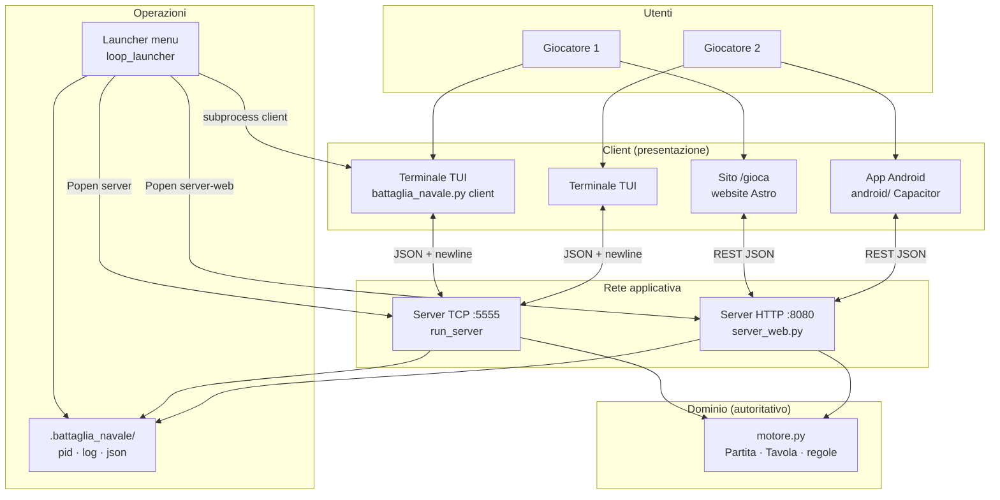

**Regola centrale:** solo `Partita` in memoria sul server (TCP o HTTP) decide stato, turno e esito colpi. I client mostrano e inviano comandi.

---

## 2. Entry point e processi

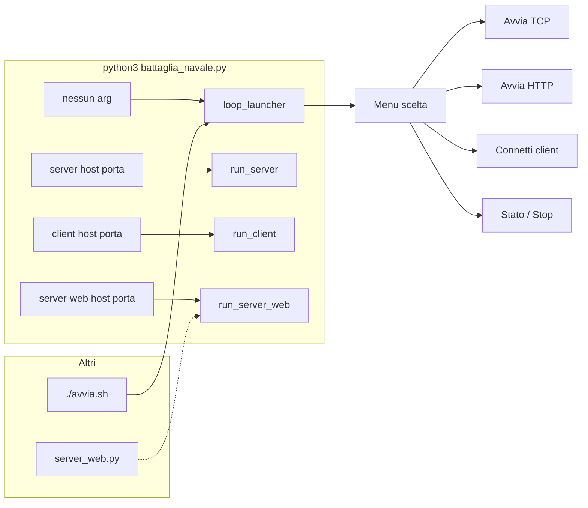

| Comando | Processo | Porta tipica |
|---------|----------|--------------|
| `(default)` | Launcher interattivo | — |
| `server` | TCP + 2 thread client | 5555 |
| `server-web` | HTTP ThreadingHTTPServer | 8080 |
| `client` | TUI + socket | verso server |

---

## 3. Motore di gioco (`motore.py`)

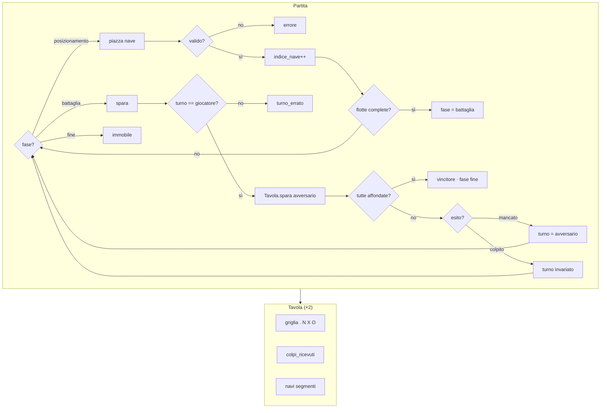

---

## 4. Server TCP terminale

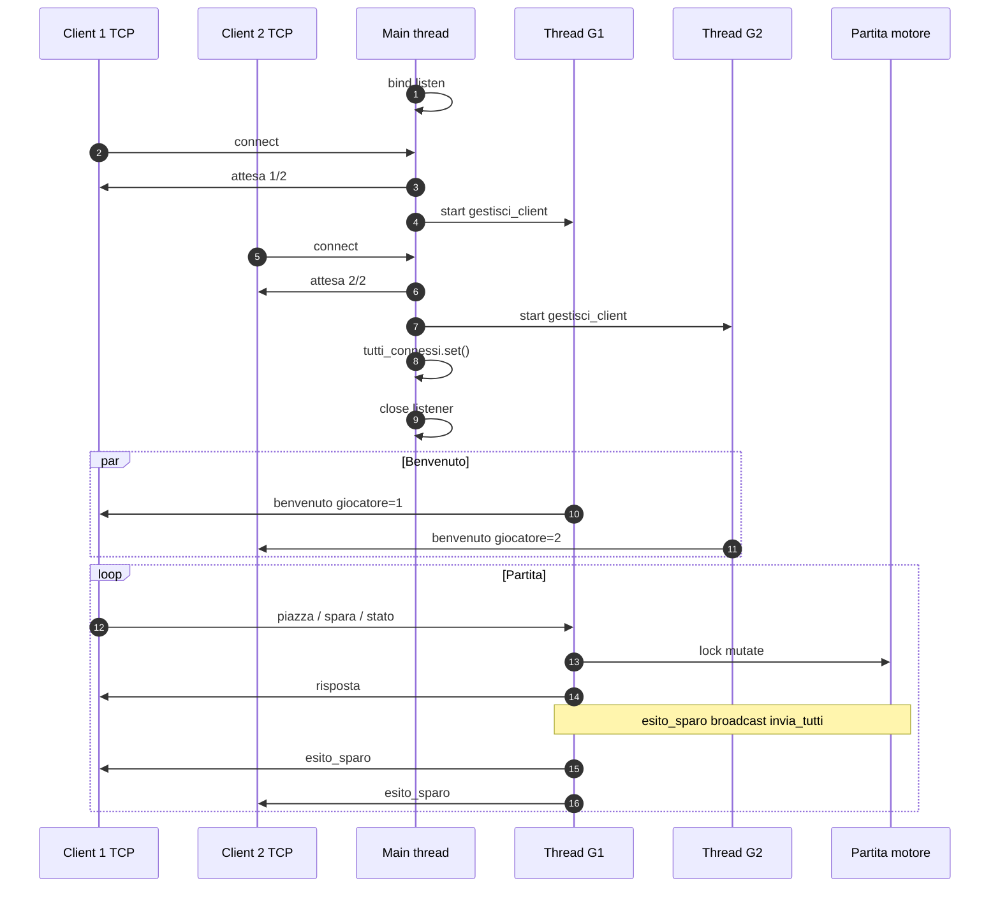

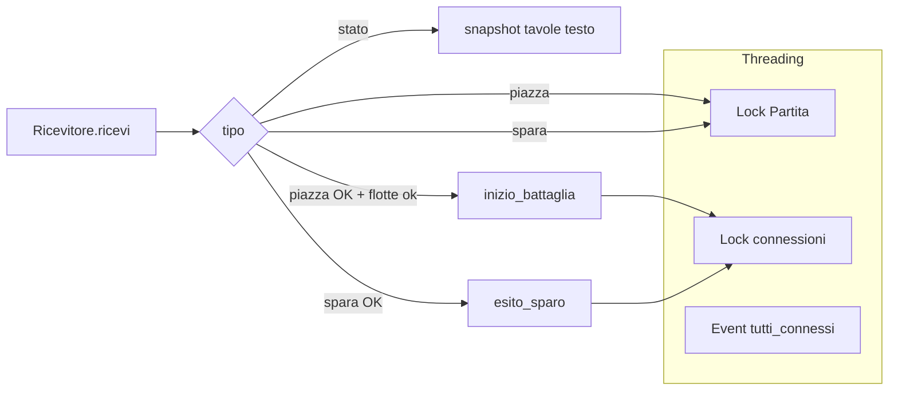

---

## 5. Server HTTP online

```mermaid
flowchart TB
    subgraph HTTP["server_web.py"]
        H[ThreadingHTTPServer]
        H --> R{path method}

        R -->|POST /api/unisciti| JOIN[token giocatore 1|2]
        R -->|GET /api/stato?token| ST[snapshot_giocatore JSON]
        R -->|POST /api/piazza| PL[piazza]
        R -->|POST /api/spara| SH[spara]
        R -->|GET /api/health| OK[ok motore python]

        JOIN --> SW[StatoWeb.partita]
        ST --> SW
        PL --> SW
        SH --> SW
    end

    SW --> MOT[Partita motore.py]

    CORS[CORS *] --> R
```

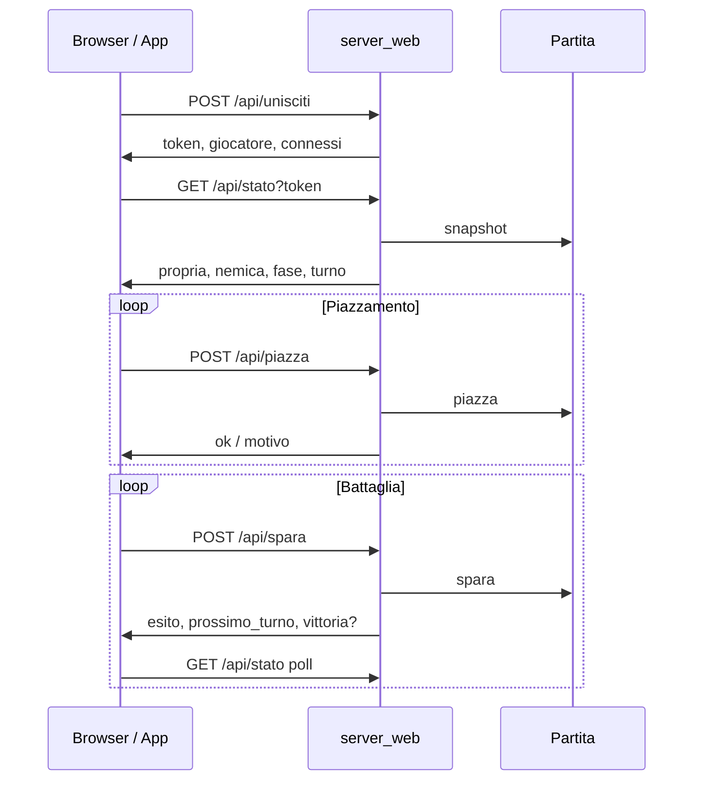

---

## 6. Client terminale

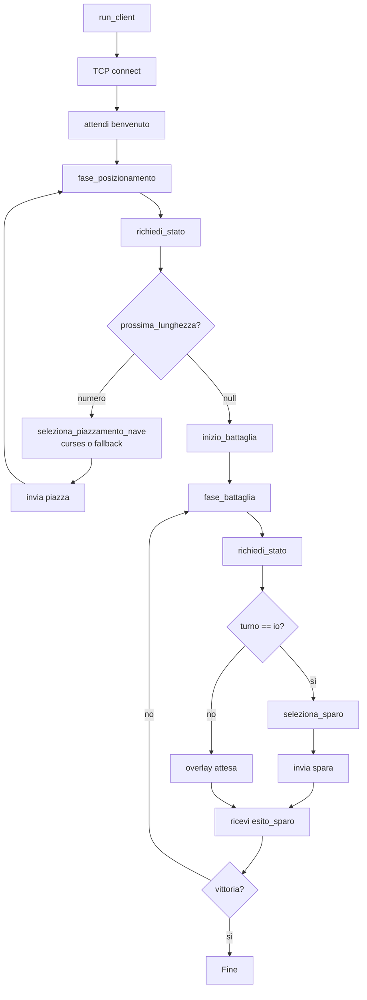

---

## 7. Client browser e Android

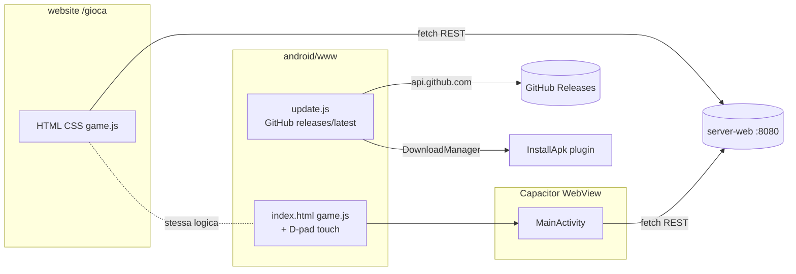

| Client | Default API (sviluppo) | Input |
|--------|------------------------|--------|
| Browser | host:8080 o Vercel + server LAN | WASD, touch nemico |
| Android | 10.0.2.2:8080 emulatore / IP LAN | D-pad, touch |

---

## 8. Regole turno in battaglia

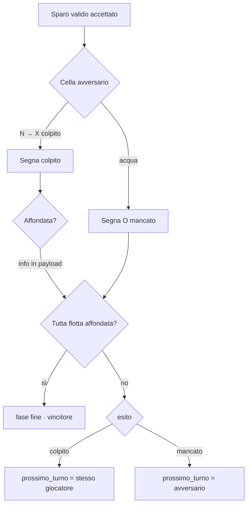

---

## 9. Launcher e lifecycle server

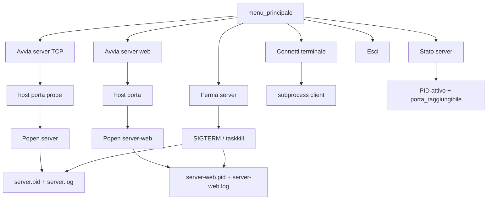

---

## 10. Build e distribuzione

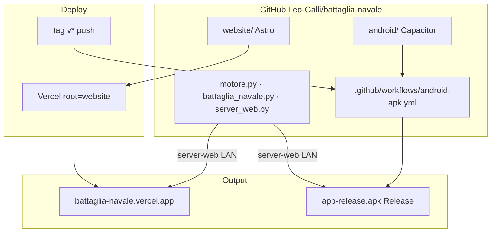

---

## Mappa file → ruolo

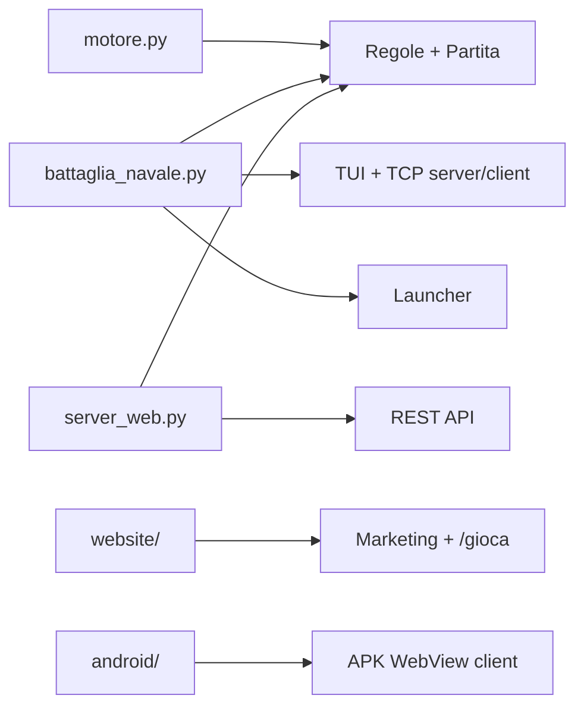

---

MIT — Leonardo Galli
